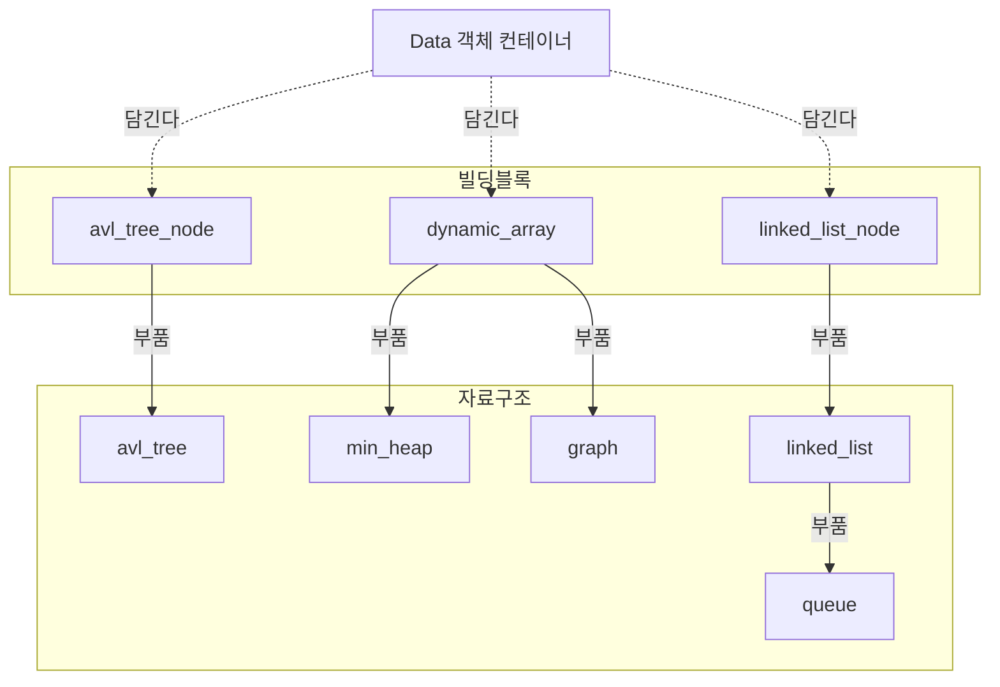

# 자료구조 설계 조망

## 목적

자료구조 설계 결정을 한곳에서 조망한다. 세 가지를 담는다 — 자료구조 간
**의존성**, 각 자료구조의 **사용처**(어느 알고리즘에서 무엇을 담아 쓰나),
각 자료구조를 **왜 선정했는가**(자료구조끼리 견주는 정당화). 보고서·발표의
원천 문서다.

여기 담는 것은 *자료구조 선정* 근거다. 개별 모듈을 *어떻게 구현하는가*의
내부 결정(예: 가상 소멸자, 비소유 정책, 균형 회전)은 각 L3 모듈 문서에 둔다.

## 범위

사용처는 두 single-agent planner(BFS+TEG, ϕ Bellman-Ford)와 그 상위
PP까지 확정해 적는다. simulator/environment 레벨의 세부는 해당 가지를
내려갈 때 보강한다. 상위까지 포함한 전체 모듈 의존성
조망(`module_dependency_map`)은 이후 이 문서를 흡수하여 작성한다.

## 계층

두 단으로 나뉜다.

- **빌딩 블록**: [[data]]를 담아 구조를 만드는 최소 부품.
  `avl_tree_node`, `linked_list_node`, `dynamic_array`.
- **자료구조**: 빌딩 블록을 조합해 만든 자료구조.
  `avl_tree`, `min_heap`, `graph`, `linked_list`, `queue`.

[[data]]는 계층 밖에 있다. 오로지 타입 불문 객체 컨테이너이며,
빌딩 블록이 담는 "한 칸"이다.

`dynamic_array`는 연속 저장·임의 접근으로 `min_heap`·`graph`의 뼈대가
되고, 노드별 dist/ϕ값·predecessor 배열로도 직접 쓰인다.
`linked_list`(←linked_list_node)는 head/tail로 양끝 O(1)을 제공해
`queue`의 뼈대가 된다. `avl_tree`는 `avl_tree_node`를 쓴다.
LIFO 구조(stack)는 이 프로젝트의 정적 layout·고정 N 특성상 고유 사용처가
없어 채택하지 않는다 — 근거는 아래 [[#선정 근거]].

## 의존성 그래프

## 화살표의 의미

두 종류의 관계가 있다. 화살표는 일관되게
**`아래(담기는/부품) → 위(담는/쓰는)`** 방향이다. 맨 아래가 `Data`,
그 위가 빌딩 블록, 그 위가 자료구조다.

- **담긴다** (점선): `Data`가 `X` 안에 한 칸으로 저장된다(`Data -.담긴다.-> X`).
  빌딩 블록(`node`, `dynamic_array`)이 Data를 담는다.
- **부품** (실선): `X`가 `Y`의 뼈대로 쓰인다(`X --부품--> Y`). `Y`의 공개
  인터페이스는 `X`를 노출하지 않는다 — `X`는 `Y` 안에 숨는다.

## 사용처

각 자료구조가 *정확히 어디서, 무엇을 담아* 쓰이는지 하나하나 적는다.
두 planner는 **BFS+TEG**(베이스라인)와 **ϕ Bellman-Ford**다.

<table>
<thead>
<tr><th>자료구조</th><th>사용처</th><th>담는 Data</th></tr>
</thead>
<tbody>
<tr><td>min_heap</td><td>PP의 Agent 우선순위 큐 (하나씩 추출)</td><td>Agent</td></tr>
<tr><td rowspan="2">avl_tree (Reservation Table)</td><td>BFS+TEG: TEG 빌드 시 점유 정점 제거 필터</td><td rowspan="2">Interval</td></tr>
<tr><td>ϕ-BF: 런타임 interval query (ϕ)</td></tr>
<tr><td rowspan="2">graph (인접 리스트)</td><td>ϕ-BF: weighted 원본 (간선 길이를 ϕ에 더함)</td><td rowspan="2">Graph Node</td></tr>
<tr><td>BFS+TEG: unweighted 확장본 → 시간 확장</td></tr>
<tr><td rowspan="2">queue (FIFO, linked_list 기반)</td><td>BFS+TEG: TEG 위 BFS 탐색 큐</td><td rowspan="2">Graph Node / TEG 정점</td></tr>
<tr><td>ϕ-BF: 라운드 전파 큐 (SPFA식)</td></tr>
<tr><td>linked_list</td><td>queue의 뼈대 (head/tail 양끝 O(1))</td><td>Graph Node</td></tr>
<tr><td rowspan="3">dynamic_array</td><td>BFS+TEG: (node,time) visited/거리, predecessor</td><td rowspan="3">값 / 포인터</td></tr>
<tr><td>ϕ-BF: 노드별 ϕ값, predecessor</td></tr>
<tr><td>min_heap·graph의 내부 뼈대</td></tr>
</tbody>
</table>

아래는 각 항목의 상세다.

**min_heap**
- PP가 Agent를 우선순위 순으로 한 번에 하나씩 꺼내는 priority queue.
  담는 것: Agent.

**avl_tree** — Reservation Table. 노드별 사용 불가 구간 `[a,b)`를 저장한다.
저장 내용은 두 planner가 동일하나, *읽는 방식*이 다르다. 담는 것: Interval.
- **BFS+TEG**: TEG를 *빌드할 때* 읽는다. 점유 구간에 해당하는 시간 확장
  정점(예: `(x,2)`)을 TEG에서 제거하는 필터로 쓴다. 탐색 중에는 보지 않는다.
- **ϕ-BF**: 탐색 *중에* 읽는다. "t 이상 첫 진입 가능 시각"(ϕ)을 묻는
  interval query로 쓴다.

**graph** — Layout 표현 (인접 리스트). 담는 것: Graph Node (정점 + 이웃 목록).
두 형태를 보유한다.
- **원본 weighted 방향 그래프**: 각 간선에 정수 길이. ϕ-BF가 이것을 받아
  간선 길이를 ϕ 계산에 직접 더한다.
- **unweighted 확장본**: 각 간선을 가상 노드로 펼쳐 모든 간선 길이 1.
  BFS+TEG가 이것을 시간 확장(TEG)하여 탐색한다.

**queue** — FIFO 탐색/전파. linked_list(head/tail)를 뼈대로 써서
enqueue(pushBack)/dequeue(popFront)가 양끝 O(1)이다. 담는 것: Graph Node
(또는 TEG 정점).
- **BFS+TEG**: TEG 위 BFS의 탐색 큐. 방문할 (node,time)을 레벨 순서로 꺼낸다.
  TEG가 unweighted이므로 우선순위 큐(min_heap)가 아니라 FIFO로 충분하다.
- **ϕ-BF**: 라운드 전파 큐. 값이 갱신된 노드를 넣고 먼저 들어온 것부터
  이웃을 재검사한다(SPFA식).

**dynamic_array** — 위 자료구조들의 내부 뼈대 + 직접 사용:
- BFS+TEG: (node,time) 단위 visited/거리 정보와 predecessor 저장.
- ϕ-BF: 노드별 ϕ값·predecessor 저장.
- 경로 복원: predecessor 배열을 목표→시작으로 역순 순회 (stack 불필요).

핵심 비교 축: **BFS+TEG는 reservation을 그래프 구조에 구워넣고**(점유 정점
제거 → unweighted라 BFS로 풀림), **ϕ-BF는 그래프를 그대로 두고 reservation을
질의로 회피한다**(interval query ϕ). 같은 reservation table을 한쪽은 빌드
필터로, 한쪽은 런타임 질의로 쓴다 — 이것이 두 알고리즘을 자료구조 활용
차이로 비교하는 이 프로젝트의 핵심이다.

ϕ 함수: 노드의 점유 불가 구간 `[a,b), [c,d), …`에 대해, `ϕ(t)`는 t 이상
이면서 실제 진입 가능한 가장 이른 시각이다. t가 어떤 구간에도 없으면
`ϕ(t)=t`, t가 `[c,d)`에 들면 `ϕ(t)=d`. ϕ-BF는 시작 0에서 간선 길이를
더하며 ϕ를 씌운 값의 최솟값으로 각 노드의 최소 도달시간을 확정하고,
predecessor 체인을 목표→시작으로 역추적해 경로를 복원한다.

## 소유권

모든 컨테이너(`avl_tree_node`, `linked_list_node`, `dynamic_array`, 그리고
이들로 만든 자료구조)는 담은 `Data*`에 대해 **비소유**다. 그 `Data*`의 생사(`new`/`delete`)는
도메인 소유자가 쥔다. 컨테이너는 포인터를 담고·옮기고·돌려줄 뿐
delete 하지 않는다. 상세는 각 모듈 문서.

## 선정 근거

**avl_tree (Reservation Table).** 노드별 점유 구간을 정렬된 상태로 들고,
"t를 포함하거나 t보다 큰 첫 구간"을 빠르게 찾아야 한다. 균형 트리는
삽입·조회를 모두 O(log n)에 보장한다. 정렬 배열은 조회는 빠르나 삽입이
O(n)이고, 해시는 구간/순서 질의를 못 한다. ϕ-BF의 interval query가
"정렬된 구간 탐색"을 직접 요구하므로 균형 트리가 가장 맞다.

**min_heap (우선순위 추출).** PP가 Agent를 우선순위 순으로 꺼내는 데 쓴다 —
"가장 작은 것 하나를 반복해서 꺼내는" 패턴이다. 힙은 최솟값 추출과 삽입을
O(log n)에 한다. 정렬 배열은 삽입마다 O(n), 비정렬 배열은 추출마다 O(n)이라
반복 추출에 불리하다. (BFS+TEG의 탐색은 unweighted라 우선순위가 필요 없어
min_heap이 아닌 FIFO queue를 쓴다 — min_heap은 PP 레벨에서만 쓰인다.)

**graph (Layout, 인접 리스트).** OHT layout은 희소 그래프다(각 정점의
이웃이 적다). 인접 리스트는 O(V+E) 공간으로 희소성을 살리고 이웃 순회가
효율적이다. 인접 행렬은 O(V²) 공간이라 희소 그래프에 낭비다.

**queue (FIFO 탐색·전파).** 두 곳에서 쓴다. BFS+TEG의 탐색 큐 — TEG가
unweighted이므로 레벨 순서 BFS면 충분하고, 먼저 도달한 것이 곧 최단이다.
ϕ-BF의 라운드 전파 큐 — 값이 갱신된 노드를 넣고 먼저 들어온 것부터 이웃을
재검사한다(SPFA식). 둘 다 "먼저 넣은 것 먼저"라는 FIFO가 맞다.

**linked_list (queue의 뼈대).** queue는 한쪽 끝에 넣고(enqueue) 반대쪽
끝에서 빼는(dequeue) 양끝 연산을 반복한다. linked_list는 head/tail 포인터로
이 양끝 연산을 O(1)에 한다. dynamic_array 원형 버퍼로도 가능하나 head/tail
랩어라운드·용량 확장 로직이 필요한 반면, 단일 연결 리스트는 포인터만으로
자연스럽게 양끝 O(1)을 얻는다. queue가 요구하는 것이 정확히 "양끝 접근"이라
linked_list가 가장 맞다. (이 프로젝트엔 *중간* 삽입/삭제는 없지만, queue의
*양끝* 삽입/삭제는 있다 — linked_list의 강점이 발휘되는 지점이다.)

**dynamic_array (범용 뼈대).** 노드별 dist/ϕ값·predecessor는 인덱스로
임의 접근하므로 연속 배열이 O(1) 접근으로 최적이다. min_heap·graph의
내부 저장소로도 연속 메모리라 캐시 효율이 좋다.

**stack 미채택.** stack(LIFO)의 자연스러운 사용처는 경로 복원의 "역추적 후
뒤집기"였다. 그러나 predecessor는 이미 노드별 `pred[]` 배열에 저장되므로,
복원은 그 배열을 목표→시작으로 역순 순회하면 끝난다 — 별도 LIFO 구조가
불필요하다. DFS·재귀 펼치기 등 다른 LIFO 사용처도 현재 알고리즘
(BFS+TEG, ϕ-BF)에는 없다. 따라서 stack도 고유 사용처가 없다.

## 미결

- `node`(avl_tree 의 빌딩블록) 개별 문서: 작성 예정.
- simulator/environment 레벨 세부 사용처: 해당 가지를 내려갈 때 보강.
