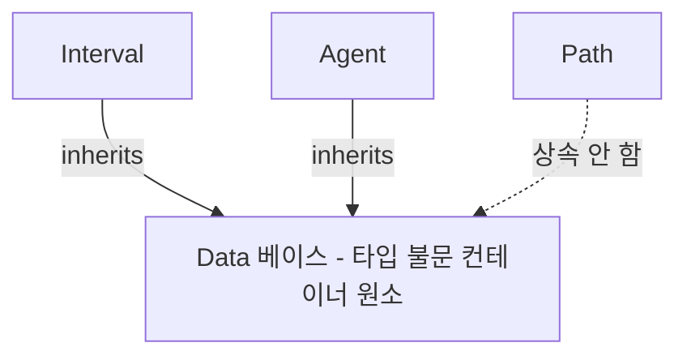

# 데이터 타입 조망 (흐르는 값)

자료구조(컨테이너·부품)의 조망은 [[data_structure_design]]이 한다. 이 문서는 그 짝으로,
**부품 사이를 흐르는 값**—구체 데이터 타입들—을 한곳에서 조망한다. 무엇이 어떤 타입인지
(L3 계약)는 `L3_interface/data_types/`의 각 노드가 갖고, 여기서는 그 위층 시야로
**역할·관계·의존**을 정리한다. (L3 `data_types/` 폴더의 z방향 상위 대응.)

## 프로젝트에서의 역할

MAPF 시뮬레이터는 세 모듈(Environment → PrioritizedPlanning → PathFinder)이
협력한다. 모듈은 *일*을 하고, 데이터 타입은 그 사이를 *오가는 화물*이다. 세 타입이
시스템의 세 접합부를 각각 맡는다:

- **[[agent]]** — 세계의 상태 단위. Environment가 들고, PP가 우선순위로 읽는다.
  "누구를 어디로 보낼까"의 입력.
- **[[path]]** — 계획의 결과. PathFinder가 만들어 PP를 거쳐 Environment가 실행한다.
  "그래서 어떻게 갈까"의 출력.
- **[[interval]]** — 충돌 회피의 매개. PP가 한 경로를 [[reservation_table]]에 점유로
  적고, 다음 에이전트가 그것을 피한다. 에이전트들을 *간접적으로* 잇는 값.

즉 Agent(입력) → Path(출력) → Interval(다음 계획의 제약)로 한 라운드의 정보가 흐른다.

## 상속 관계 (추상화 축)

- [[interval]]·[[agent]]는 [[data]]를 **상속**한다 — 둘 다 컨테이너에 담겨
  `operator<`로 정렬·추출되기 때문(Interval→[[avl_tree]] 시작점 순, Agent→[[min_heap]]
  우선순위 순). [[data]]가 선언한 가상 비교 계약을 각자 구체화한다.
- [[path]]는 [[data]]를 **상속하지 않는다** — 어떤 컨테이너에도 담기지 않고(PP가
  `Path[]`를 직접 다룸) 비교도 없다. 컨테이너 원소가 아니라 *값 타입*이라 Data 계약이
  무의미하다. "모든 객체는 Data"의 의도된 경계 사례.

## 흐름·소유 관계 (구성 축)

| 타입 | 생산/소유 | 흐르는 경로 | 담기는 컨테이너 |
|---|---|---|---|
| [[agent]] | [[environment]]가 소유 | Environment → (읽기) [[planner]] | [[min_heap]] (비소유 빌림) |
| [[path]] | [[bfs_teg]]가 생산 | PathFinder → [[planner]] → [[environment]] | — (배열로 직접 보유) |
| [[interval]] | [[reservation_table]]가 소유 | PP가 기록 → 다음 에이전트가 회피 | [[avl_tree]] |

소유는 명확히 한 모듈에 있고(누가 `new`/`delete`), 컨테이너는 모두 **비소유**로 담는다
(수명은 도메인 소유자가 쥠). 상세 소유 정책은 [[data_structure_design#소유권]].

## 경계 — 무엇이 여기 들어오나

여기 모으는 것은 *컨테이너 사이를 흐르는 구체 값 타입*이다. 다음은 제외:

- **[[data]]**(베이스) — 흐르는 값이 아니라 모든 컨테이너의 타입 불문 베이스라
  `data_structure/`에 둔다. 위 타입들이 이를 상속(또는 의도적으로 비상속).
- **TEG 정점** — [[bfs_teg]] 내부에서 정수 인코딩(`node*(H+1)+t`)으로 다뤄 별도 Data
  자식을 두지 않는다.
- **한 함수 안 임시값** — 모듈 경계를 넘지 않으므로 노드가 아니다.
