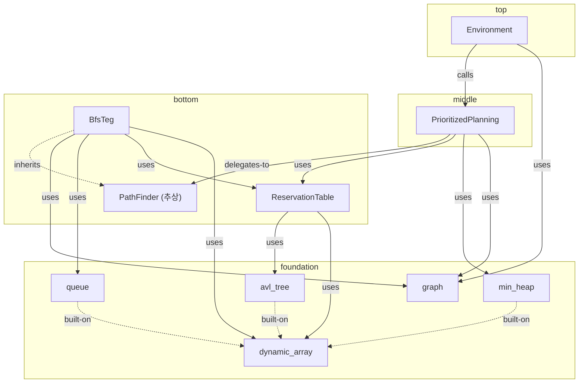
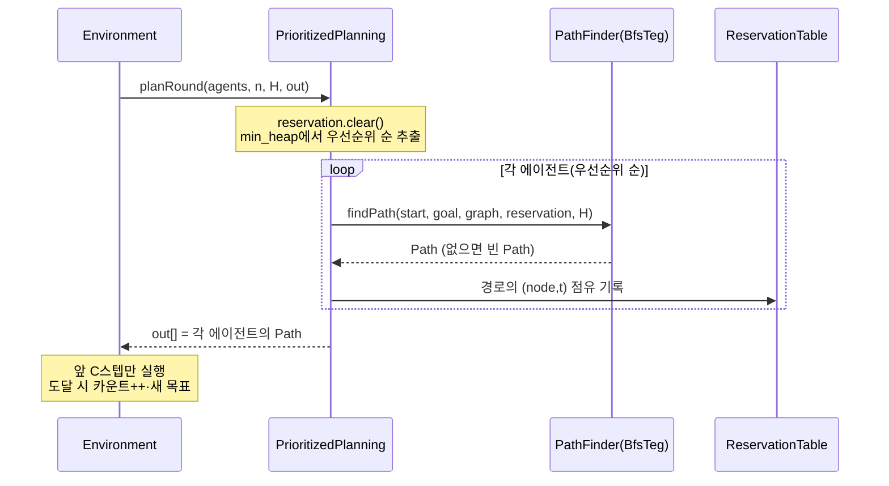

# 시스템 아키텍처 조망 (구성 축)

[[folder_structure_and_responsibilities]]가 *추상화 축*(L0~L5 폴더)을 다룬다면, 이
문서는 그와 직교하는 **구성 축**을 다룬다 — 같은 L3 계약 층 안에서 모듈들이 "누가
누구를 쓰는가"로 어떻게 협력하는지. 두 축의 정의는 [[L1]]·[[L2]].

조망의 단위는 **부품(모듈)**이다. 부품 사이를 흐르는 *값*(Agent·Path·Interval)은
[[data_types]], 토대 *컨테이너*들의 선정 근거는 [[data_structure_design]]에 있다.

## 구성 축: top → foundation

부르는 쪽이 위(top), 토대가 아래(foundation)다. 상류는 하류의 **계약**만 알고
내부는 모른다.

| 높이             | 모듈                                                                      | 한 줄 책임                           |
| -------------- | ----------------------------------------------------------------------- | -------------------------------- |
| **top**        | [[environment]]                                                         | 세계를 돌린다 — 시간 진행·도달 처리·throughput |
| **middle**     | [[planner\|PrioritizedPlanning]]                                        | 한 라운드 전체 에이전트를 우선순위 순으로 조율       |
| **bottom**     | [[bfs_teg]] (PathFinder)                                                | 단일 에이전트의 시간제약 최단경로               |
| **bottom**     | [[reservation_table]]                                                   | 노드별 시간 점유를 저장·질의(충돌 회피의 매개)      |
| **foundation** | [[graph]] · [[avl_tree]] · [[min_heap]] · [[queue]] · [[dynamic_array]] | 공용 자료구조 토대                       |

## 의존 그래프

엣지 = 구성 축 관계(`calls`/`delegates`/`uses`/`owns`/`inherits`). 위에서 아래로
의존이 흐른다.

> `delegates-to`는 전략 패턴이다 — PP는 추상 `PathFinder`에만 의존하고, 주입된
> [[bfs_teg]]가 알고리즘을 결정한다(ϕ Bellman-Ford 같은 새 구현은 클래스 추가만으로
> 끼운다, PP 불변). 토대 사이의 `built-on`(min_heap·queue·avl_tree → dynamic_array)
> 관계는 [[data_structure_design]]의 "부품" 화살표와 같다.

## 흐르는 값과 소유

모듈이 *부르고*, 값이 *흐른다*. 한 라운드에서:

흐르는 값의 소유·상속은 [[data_types]]: [[agent]]는 Environment 소유(PP가 읽기),
[[path]]는 PathFinder가 생산해 관통, [[interval]]은 ReservationTable 소유.

## 두 축 좌표

한 모듈은 (추상화 레벨, 구성 높이) 두 좌표를 가진다. 시각화는 이를 공간으로 분리할
수 있다(레벨=한 평면, 높이=다른 축, 관계종류=엣지 색 — [[L2]]·[[work_log]]).

| 모듈 | 추상화(레벨) | 구성(높이) |
|---|---|---|
| [[environment]] | L3 계약 / L4 기전 / L5 코드 | top |
| [[planner\|PrioritizedPlanning]] | L3 / L4 / L5 | middle |
| [[bfs_teg]] | L3 / L4 / L5 | bottom |
| [[reservation_table]] | L3 / L4 / L5 | bottom |
| [[graph]] 등 토대 | L3 / L4 / L5 | foundation |

같은 모듈의 레벨 간 연결(L3↔L4↔L5)은 추상화 축(`refines`/`abstracts`), 같은 레벨
안의 모듈 간 연결은 구성 축(위 그래프)이다.

## 확장 지점

이 아키텍처는 *교체 가능성*을 위해 설계됐다. 가장 큰 확장은 **두 번째 PathFinder
(ϕ Bellman-Ford)** — `PathFinder`를 상속해 `delegates-to` 자리에 끼우면 PP·Environment
코드를 건드리지 않고 비교 실험이 된다(프로젝트 원목표, [[L1_purpose/README]] Tier 2).
같은 [[reservation_table]]을 BfsTeg는 탐색 시 `isFree`로, ϕ-BF는 런타임 interval
query로 읽는 차이가 비교의 핵심 축이다([[data_structure_design#사용처]]).
